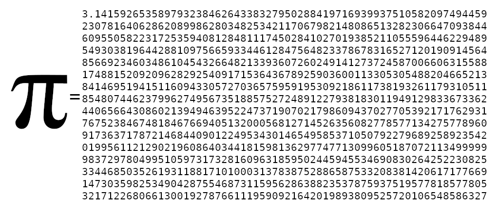

 

# Tiny Tapeout Pi (π)

This circuit outputs the first 1024 decimal digits of Pi (π), including the
decimal after the three. The repository started out as something else, but
after completing the 16x8 SRAM circiut (128 bits), I became curious about just
how much information could be packed into the circuit area.  The D flip flops
in SRAM aren't particularly dense and the circuit has other functionality
beyond information storage.  For this demonstration, I needed something without
a logical pattern, something familiar, and something which would exercise all
the LEDs in the seven segment display.  The Pi constant was perfect.  After a
number of experiments in Verilog, trying the Espresso Heuristic Logic Minimizer
tool, the best results ended up being a large boring block of case statements
and letting the toolchain figure it out. The information limit I found was
`1023*log2(10)+1 ~= 3,400` bits, after which the toolchain struggled.  However,
it appears in this case that the layout is limited by metal, not combinatorial
logic.  I am interested to hear about better strategies to do something like
this with synthesizable Verilog.

## How to use

The clock is used to drive the incremental changes in the display.  The reset
pin is used to zero the index.

## What is Tiny Tapeout?

TinyTapeout is an educational project that aims to make it easier and cheaper
than ever to get your digital designs manufactured on a real chip!

Go to https://tinytapeout.com for instructions!
